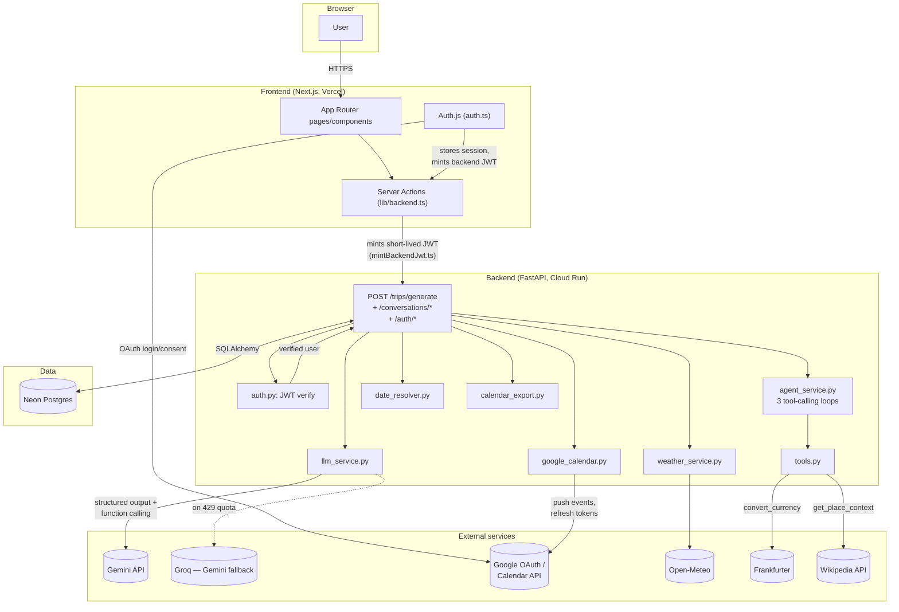
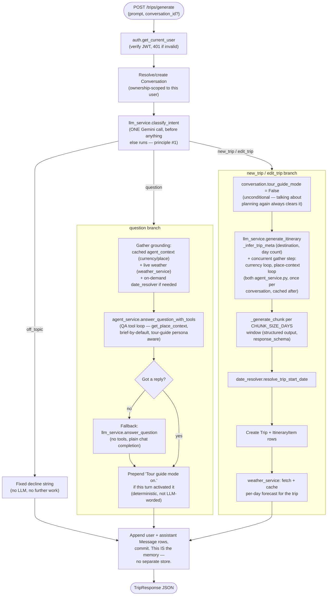
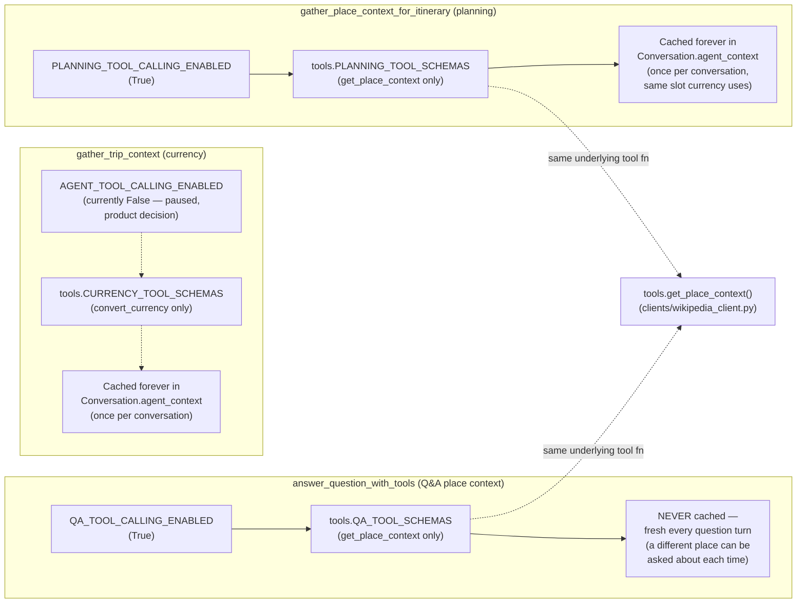
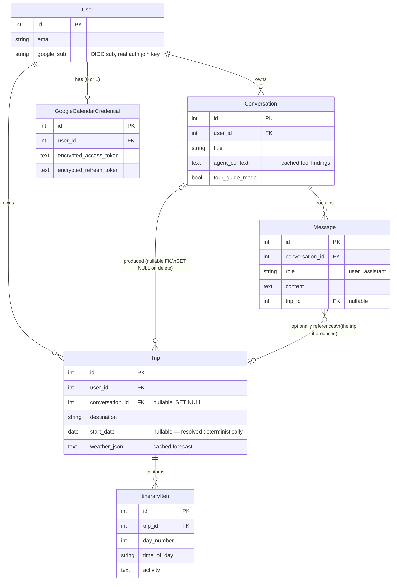
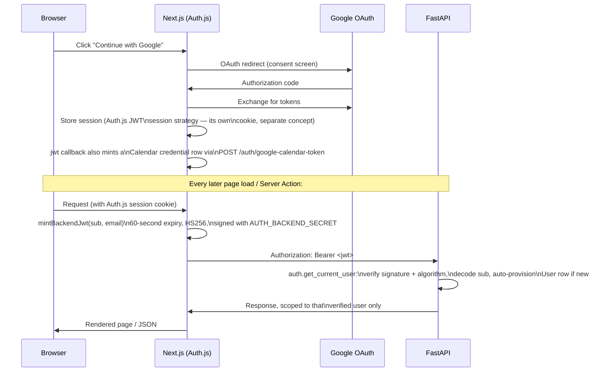
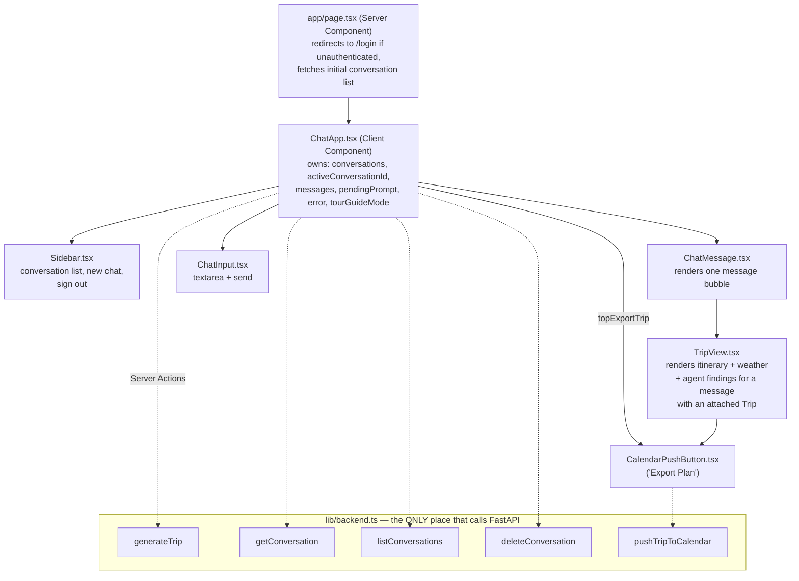
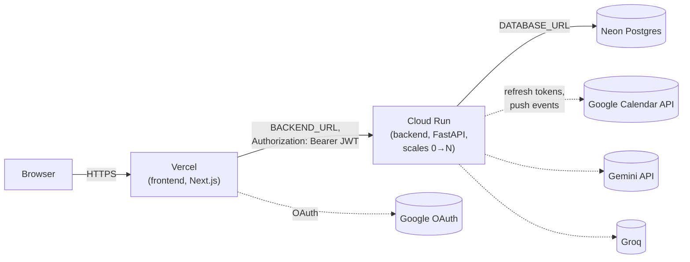

# Architecture: how everything is linked and interacts

**A visual companion to [`decisions.md`](../decisions.md)'s Architecture
section — that section is the prose source of truth for *why* things are
built this way; this document is the *how it's wired* map, for orienting
quickly in a codebase this size. Written 2026-08-30. If the two ever
disagree, trust the code, then flag the mismatch rather than trusting
either doc blindly (same rule `CLAUDE.md` states about itself).**

## 1. System overview — every service and what talks to what

## 2. The single request-router: `POST /trips/generate`

Every user message — new trip, edit, follow-up question, off-topic — goes
through **one** handler ([`routers/trips.py`](../backend/app/routers/trips.py)).
There is no separate chat/message endpoint. This is the fork point for
the entire backend:

## 3. The three isolated tool-calling loops

`agent_service.py` runs three **deliberately separate** Gemini
function-calling loops — same underlying mechanism, different flags,
different schemas, different caching rules, on purpose (so flipping one
loop's kill switch can never make another loop's tool reachable, and so
each loop's caching behavior matches what that data actually needs — see
[`decisions.md`](../decisions.md)'s "Place context" entry for the full reasoning):

## 4. Data model

Two relationship details worth calling out because they're easy to miss
reading the models alone:

- `Trip.conversation_id` is `ON DELETE SET NULL`, not cascade — deleting a
  chat unlinks its trips rather than deleting them.
- `Message.trip_id` is only ever set for `new_trip`/`edit_trip` turns —
  a `question`-intent turn's assistant `Message` always has `trip_id =
  NULL`, which is *why* `tour_guide_mode` had to be exposed on
  `ConversationDetail` rather than `TripResponse` (see
  [`progress.md`](../progress.md)'s 2026-08-29 tour-guide-mode-refinements
  entry) — a question-turn message has no trip to attach a field to.

## 5. Auth: the BFF (backend-for-frontend) pattern

Neither service trusts the other's raw session state — Next.js owns the
real Google OAuth session, FastAPI only ever sees a short-lived,
purpose-built JWT:

`AUTH_BACKEND_SECRET` is the one shared secret both services read from
the same root `.env` — a mismatch between them 401s every single backend
call, the most common real misconfiguration in this flow.

## 6. Frontend: component and state ownership

`tourGuideMode` state (drives the amber accent override, see
`globals.css`'s `[data-tour-guide-mode="true"]` block) is set from
whatever `getConversation` last reported — no separate toggle logic, it
just reflects the backend's `ConversationDetail.tour_guide_mode` field
directly.

## 7. Deployment topology (once `docs/deployment-guide.md` is followed)

Local dev mirrors this topology exactly (same Neon instance, same
external APIs) — the only thing that changes between local and deployed
is where the frontend/backend processes themselves run, per
`docker-compose.yml` vs. the individual `preview_start`/`uvicorn --reload`
paths documented in `README.md`.
